# LabLog

**A local lab notebook for ferroelectric oxide thin film growth and characterization.**

LabLog is a self-hosted web app that keeps deposition recipes, raw measurement files, and publication-ready plots in one place. No cloud, no accounts — just a SQLite database and a dev server running on your own machine.

---

## Installation

### Requirements

- Python 3.9+
- Node.js 18+

### 1. Clone and set up

```bash
git clone https://github.com/CarpOfTruth/lab-notebook.git
cd lab-notebook
npm run setup
```

This creates the Python virtual environment, installs all dependencies, and copies the default config.

### 2. Load demo data (optional)

The repo ships with measurement files for four BaTiO₃ / SrRuO₃ / Si:STO samples (SP022 – SP025) from a sputter pressure series (3 – 5 mTorr), plus a pre-configured Analysis Book comparing them across all panel types.

```bash
npm run seed
```

Re-run with `--overwrite` to reset to a clean demo state:

```bash
npm run seed -- --overwrite
```

Your own data lives in `backend/data/` and is gitignored.

### 3. Start

```bash
npm start
```

Open **http://localhost:5173**.

---

## Features

### Dashboard

Samples are organized into named, color-coded **folders** (growth series). Each card shows the deposition technique, substrate, layer material chips (SrRuO₃, BaTiO₃, etc.), notes, and a count of attached datasets. **Analysis Books** appear below for cross-sample comparisons and can themselves be grouped into book folders.

A **dark / light mode** toggle is always visible in the top bar and persists across sessions.

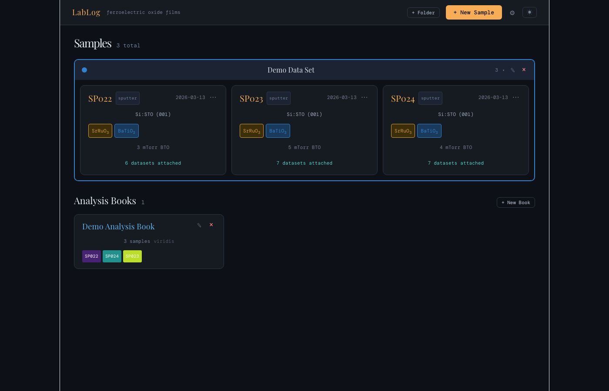

### Creating a sample

Click **+ New Sample** to open the creation dialog. Choose sputter or PLD technique, enter an ID, date, substrate, thickness, notes, and optionally assign the sample to a folder.

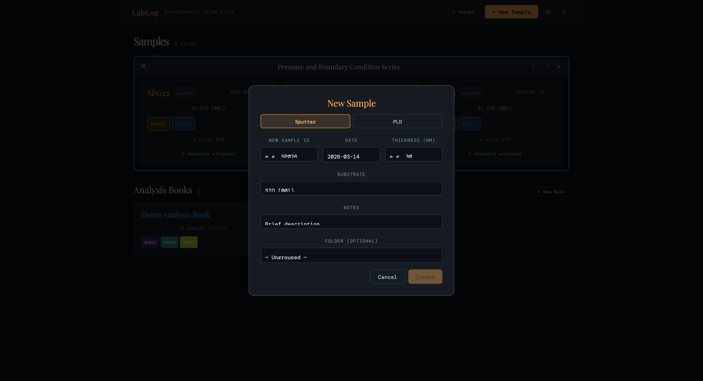

### Settings & material library

The gear icon opens **Settings**, where you configure global deposition defaults (temperature, pressure, O₂ %, time, power/energy) for both sputter and PLD. The **Material Library** stores per-material target defaults — when you add a layer and type a known material, parameters auto-fill.

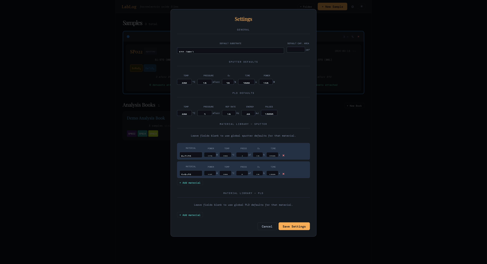

### Deposition recipe editor

Multi-layer recipes are stored per sample. Both **sputter** and **PLD** techniques are supported with their own parameter sets. Layers are drag-reorderable. Click **+ Add Layer** to open the inline layer form, which pulls defaults from the material library.

| Sputter | PLD |
|---------|-----|
| Temperature (°C) | Temperature (°C) |
| Pressure (mTorr) | Pressure (mTorr) |
| O₂ % | Rep rate (Hz) |
| Power (W) | Energy (mJ) |
| Time (s) | Pulse count |

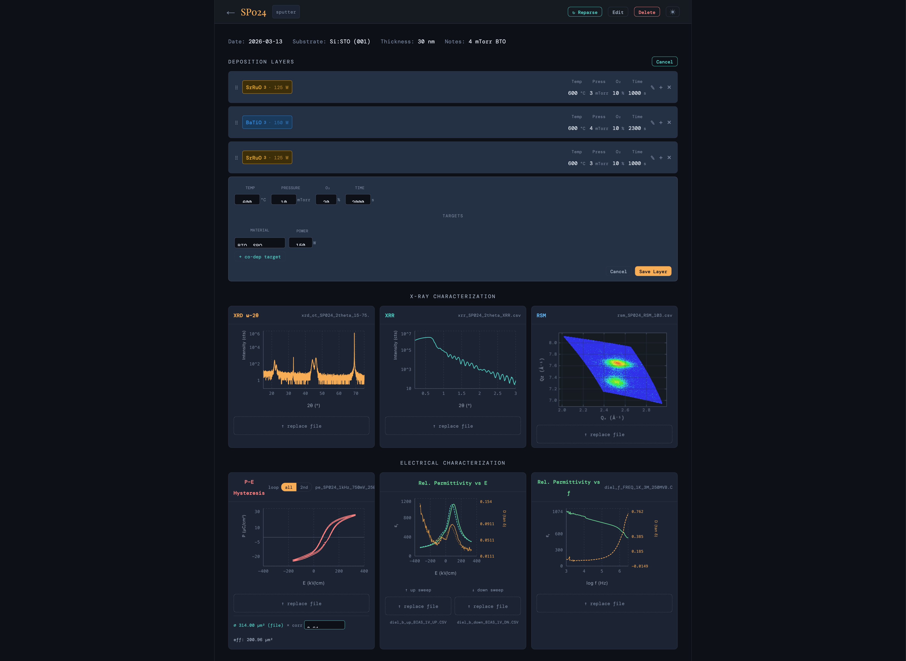

### X-ray characterization

Three X-ray panels per sample: **XRD ω-2θ** (log-scale intensity vs 2θ), **XRR** (reflectivity curve for thickness extraction), and **RSM** (false-color Qₓ–Qz heatmap for epitaxial strain analysis).

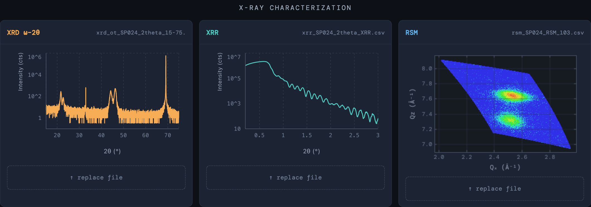

### Electrical characterization

Three electrical panels per sample:

- **P-E Hysteresis** — polarization (µC/cm²) vs field (kV/cm). A loop toggle switches between full double loop and isolated 2nd loop.
- **εᵣ vs E** — butterfly permittivity curve from a bipolar voltage sweep, with tan δ on the right axis.
- **εᵣ vs frequency** — frequency dispersion from 1 kHz – 3 MHz on a log axis, with tan δ on the right axis.

The capacitor area is entered per sample and the correction factor is shown inline.

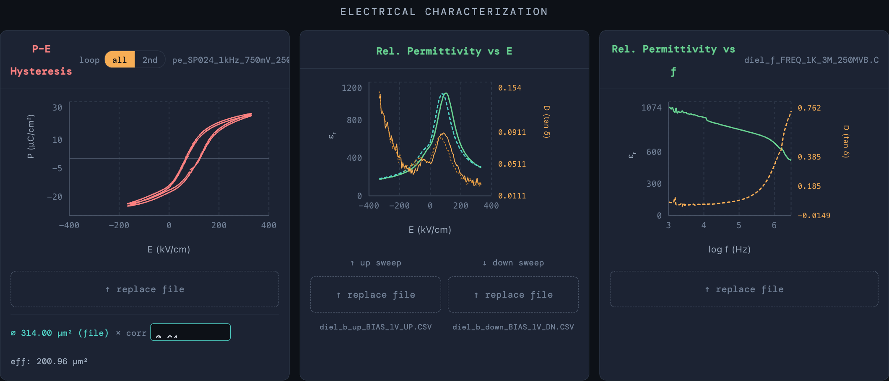

### Analysis Books

Collect any set of samples into an **Analysis Book** for synchronized, side-by-side comparisons. Samples are assigned colors from a continuous scale (Viridis, Plasma, Inferno, Magma, or Coolwarm) with a configurable trim to avoid washed-out endpoints.

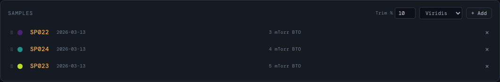

Comparison panels (each independently added/removed via **+ Add Panel**):

| Panel | What it shows |
|-------|---------------|
| **XRD ω-2θ** | Waterfall with configurable inter-sample offset (decades) |
| **RSM** | Per-sample heatmap gallery |
| **P-E Hysteresis** | Overlaid loops, all-loop or 2nd-loop toggle |
| **εᵣ vs E** | Overlaid butterfly curves |
| **εᵣ vs frequency** | Overlaid frequency dispersion |
| **Meta-Analysis** | Scatter plot of any extracted parameter vs any other |

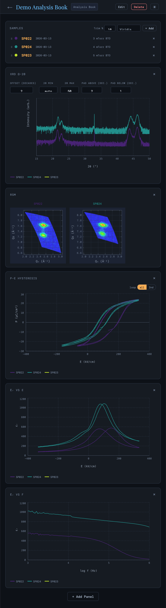
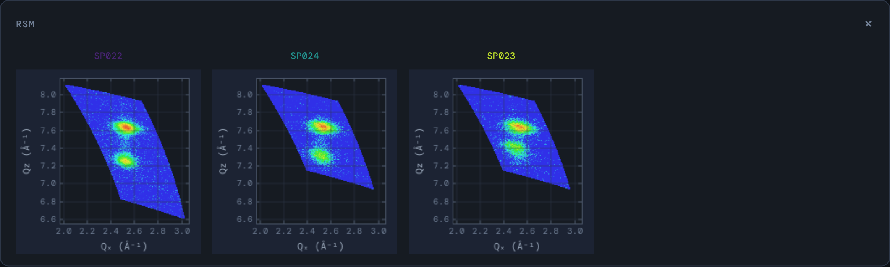
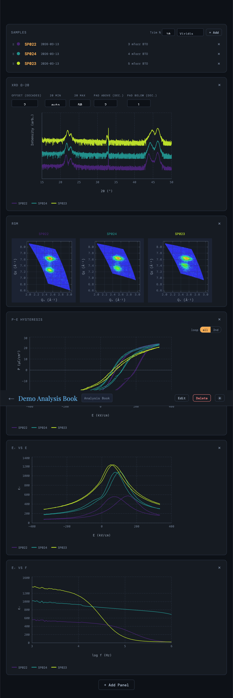
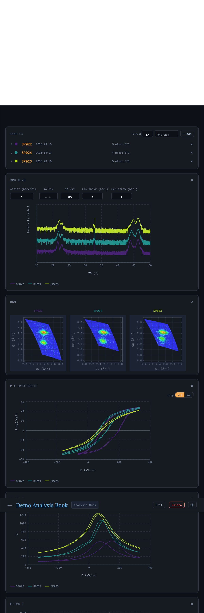
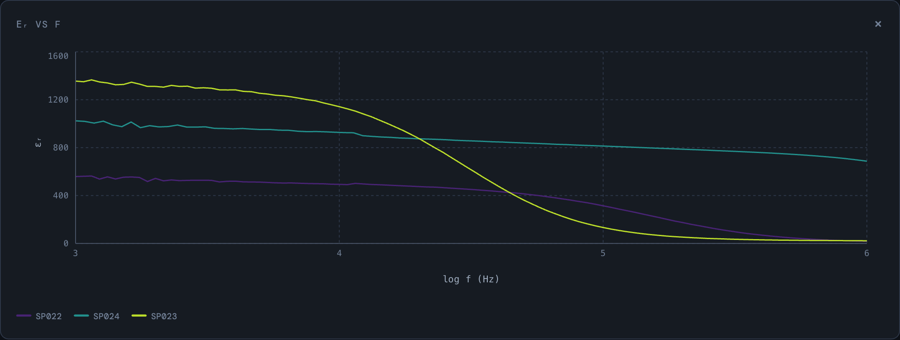

### Meta-Analysis

The **Meta-Analysis** panel plots any extracted parameter against any other across all samples in a book. X and Y axes are chosen from a dropdown of all available quantities — growth conditions (pressure, temperature, O₂ %, time, power/energy) and fitted measurement parameters (remnant polarization Pᵣ, coercive field Eᶜ, saturation polarization Pₛ, permittivity εᵣ, and loss tan δ at any field or frequency).

A second Y axis can be added for direct overlay of two different parameters. Marker color and style are configurable per axis.

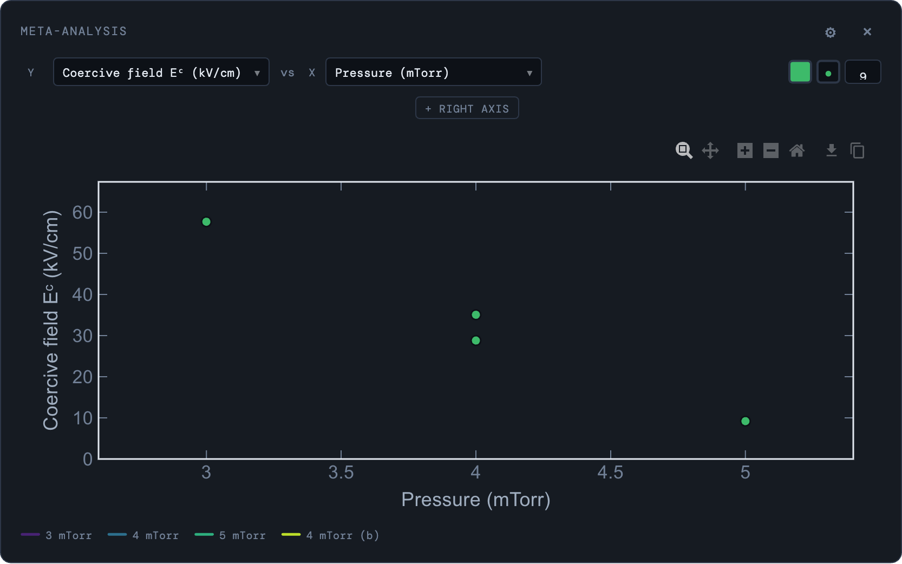
