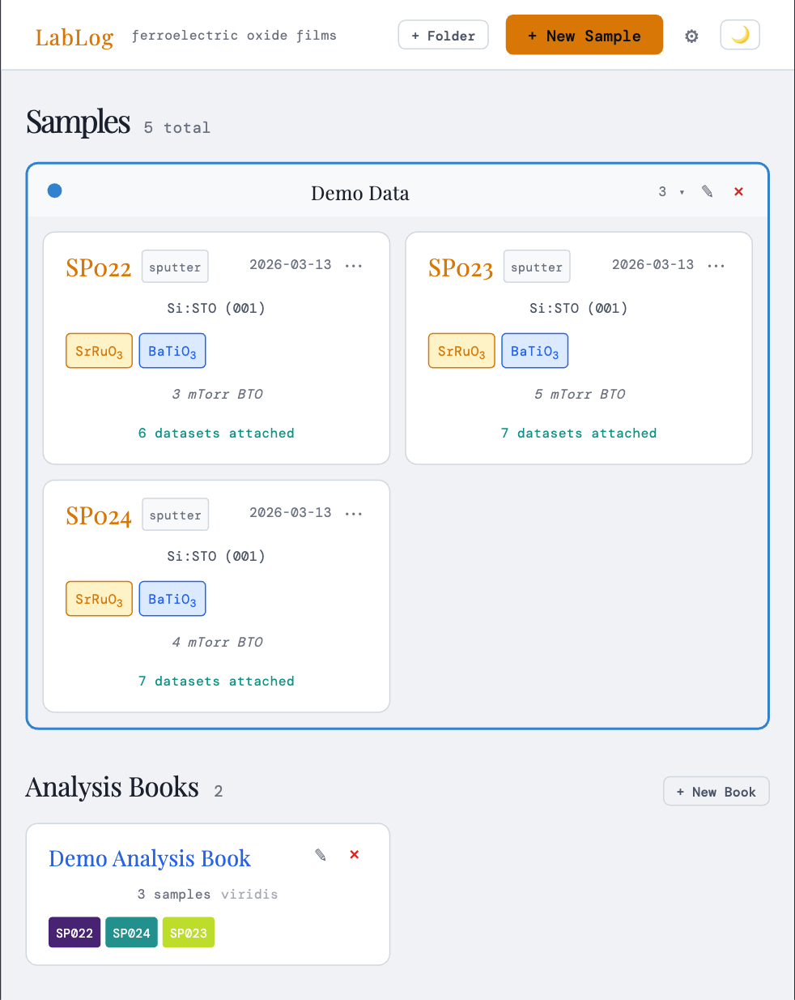
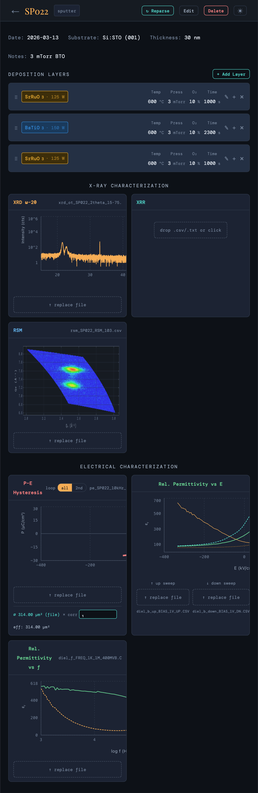
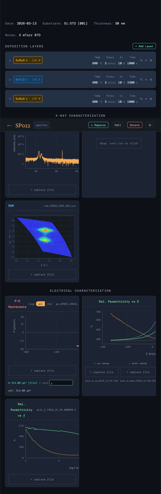
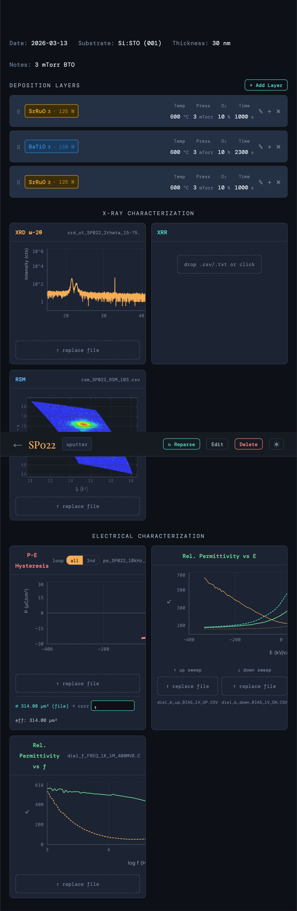
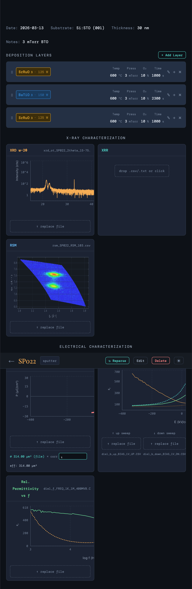
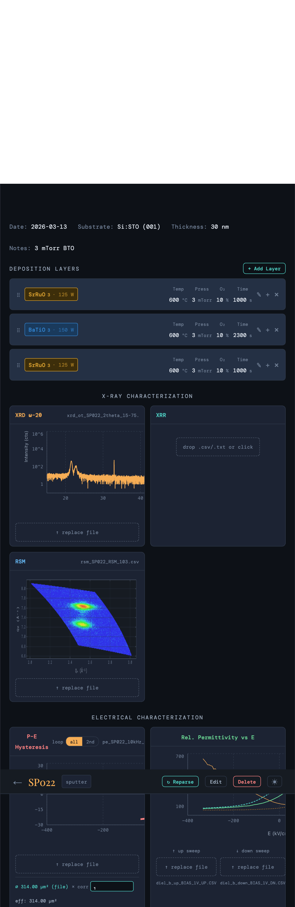
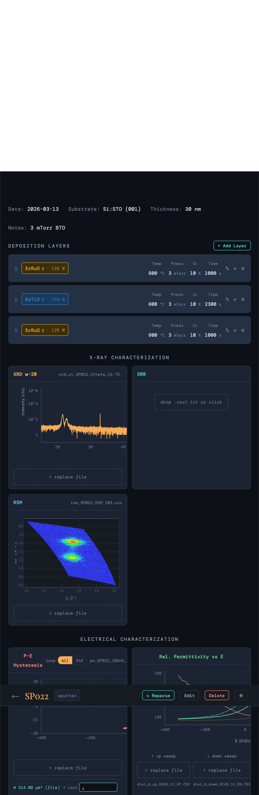

# LabLog

**A local lab notebook for ferroelectric oxide thin film growth and characterization.**

LabLog is a self-hosted web app that keeps deposition recipes, raw measurement files, and publication-ready plots in one place. No cloud, no accounts — just a SQLite database and a dev server running on your own machine.

---

## What it does

### Sample tracking & organization

Samples are organized into named, color-coded **folders** (growth series). Each card shows the deposition technique, substrate, stacked-layer material chips with chemical subscripts (SrRuO₃, BaTiO₃, etc.), free-text notes, and a count of attached datasets.




A **dark / light mode** toggle is always visible in the top bar and persists across sessions.

---

### Deposition recipe editor

Multi-layer recipes stored per sample. Both **sputter** and **PLD** techniques are supported, each with their own parameter set.

| Sputter | PLD |
|---------|-----|
| Temperature (°C) | Temperature (°C) |
| Pressure (mTorr) | Pressure (mTorr) |
| O₂ % | Rep rate (Hz) |
| Power (W) | Energy (mJ) |
| Time (s) | Pulse count |

A per-material **library** (in Settings) stores target defaults so repeated materials auto-fill. Layers are drag-reorderable.



---

### X-Ray Diffraction (XRD ω-2θ)

Log-scale intensity vs 2θ plot rendered in canvas. Configurable axis range.



---

### Reciprocal Space Maps (RSM)

False-color Qₓ–Q_z heatmap. Intensity is log-scaled and mapped to a thermal color palette. Useful for checking epitaxial strain state of thin film peaks relative to the substrate.



---

### P-E Hysteresis

Area-corrected polarization (µC/cm²) vs electric field (kV/cm). A **loop toggle** switches between the full double loop and the isolated 2nd loop. The split point is detected from the sweep's starting voltage — works correctly for biased loops.

The effective capacitor area is entered per sample (from the file or manually corrected), and the correction factor is shown inline so the math is always auditable.



---

### Dielectric spectroscopy

Two views, each with εᵣ on the left axis and tan δ (loss) on the right:

- **εᵣ vs E** — classic butterfly curve from a bipolar voltage sweep (up and down sweeps overlaid)
- **εᵣ vs frequency** — frequency dispersion from 1 kHz – 3 MHz on a log axis




---

### Analysis Books

Collect any set of samples into an **Analysis Book** for synchronized, side-by-side comparisons across all measurement types. Samples are color-scaled (viridis, plasma, inferno, magma, or a custom ramp) with a configurable trim to avoid washed-out endpoints.

Available comparison panels (each independently shown/hidden):

| Panel | What it shows |
|-------|---------------|
| **XRD ω-2θ** | Waterfall with configurable inter-sample offset (decades) |
| **RSM** | Per-sample heatmap gallery |
| **P-E Hysteresis** | Overlaid loops, all-loop or 2nd-loop toggle |
| **εᵣ vs E** | Overlaid butterfly curves |
| **εᵣ vs frequency** | Overlaid frequency dispersion |


---

## Quick start

### 1. Backend

```bash
cd backend
python3 -m venv .venv
source .venv/bin/activate      # Windows: .venv\Scripts\activate
pip install -r requirements.txt
cp config.example.json config.json
uvicorn main:app --reload
```

### 2. Frontend

```bash
cd frontend
npm install
npm run dev
```

Open **http://localhost:5173**.

---

## Demo data

The repo ships with measurement files for three BaTiO₃ / SrRuO₃ / Si:STO samples (SP022 – SP024) spanning a sputter pressure series (3, 4, 5 mTorr), plus a pre-configured **Demo Analysis Book** that compares them across all panel types.

To load the demo data into a fresh database:

```bash
cd backend
python3 seed_demo.py
```

Re-run with `--overwrite` to reset demo records:

```bash
python3 seed_demo.py --overwrite
```

The seed script creates:
- Folder **"Pressure and Boundary Condition Series"**
- Samples **SP022**, **SP023**, **SP024** with full layer recipes and all measurement files
- Analysis Book **"Demo Analysis Book"** (XRD + RSM + PE + εᵣ(E) + εᵣ(f), viridis color scale)

Demo files live in `backend/demo_data/` and are committed to the repo. Your live data stays in `backend/data/` which is `.gitignore`d.

---

## Data layout

```
backend/
  data/              # gitignored — your live data
    lablog.db        # SQLite database
    files/
      SP022/
        xrd_ot_SP022_2theta_15-75.csv
        rsm_SP022_RSM_103.csv
        pe_SP022_10kHz_700mV_400mVb.txt
        ...
  demo_data/         # committed — ships with the repo
    seed.json        # folder / sample / book metadata
    files/
      SP022/  SP023/  SP024/
```

Accepted file formats: **CSV** (two-column or header-delimited) and **TXT** (binary ferroelectric tester output). The backend parses raw files on demand and returns JSON — no pre-processing step needed.

### Database schema

| Table | Key columns |
|-------|-------------|
| `folders` | `id`, `name`, `color` |
| `samples` | `id`, `date`, `substrate`, `thickness_nm`, `area_m2`, `area_correction`, `technique`, `folder_id`, `layers` (JSON), `filenames` (JSON) |
| `analysis_books` | `id`, `name`, `sample_ids` (JSON), `config` (JSON) |

---

## Stack

| Layer | Tech |
|-------|------|
| Frontend | Vite + React, Recharts, custom canvas plots |
| Backend | FastAPI, SQLite (via stdlib `sqlite3`) |
| Styling | CSS-in-JS (inline styles), DM Mono font |

---

## Adding screenshots

To update the screenshots in `docs/screenshots/`, run the app with demo data loaded and capture the following views:

| File | What to capture |
|------|-----------------|
| `samples-dark.png` | Home page, dark mode, folder expanded |
| `samples-light.png` | Home page, light mode |
| `sample-detail-layers.png` | SP022 detail, deposition layers section |
| `sample-detail-xrd.png` | SP022 detail, XRD ω-2θ plot |
| `sample-detail-rsm.png` | SP022 detail, RSM heatmap |
| `sample-detail-pe.png` | SP022 detail, P-E hysteresis loop |
| `sample-detail-diel-e.png` | SP022 detail, εᵣ vs E butterfly |
| `sample-detail-diel-f.png` | SP022 detail, εᵣ vs frequency |
| `book-xrd.png` | Demo Analysis Book, XRD comparison panel |
| `book-pe.png` | Demo Analysis Book, P-E comparison panel |
| `book-de.png` | Demo Analysis Book, εᵣ vs E comparison panel |

---

## Contributing

- `main` — stable
- `dev` — active development; PRs target `dev` before merging to `main`
